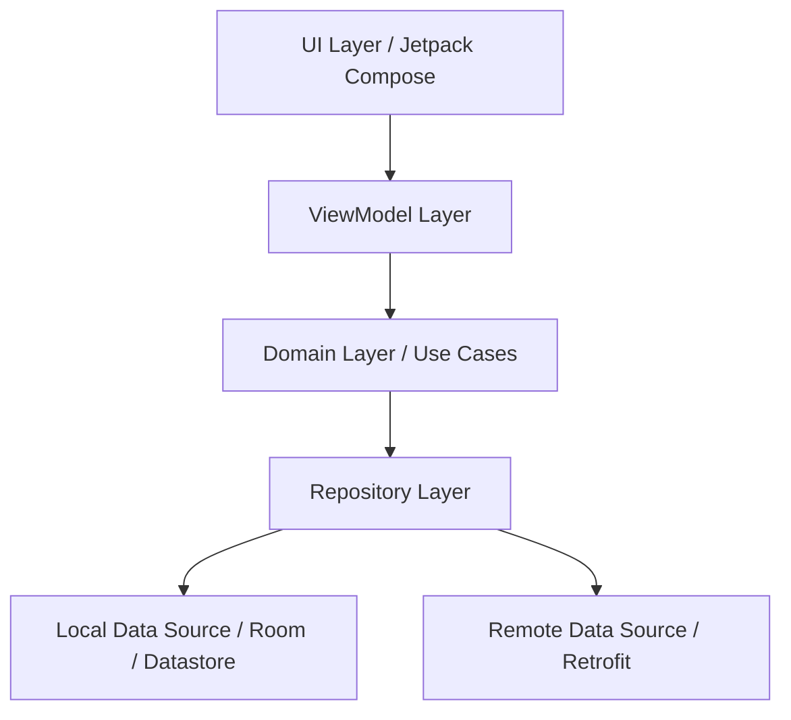

<div align="center">
  
  
  <h1>Ayah 📖🕋</h1>
  <p>A beautifully designed, feature-rich Quran and Prayer Times application for Android, built entirely with modern Android development tools.</p>

  <div>
    
    
    
    
  </div>
</div>

---

## ✨ Features

- **📖 Holy Quran:** Read the Holy Quran with a beautiful, distraction-free interface (using the King Fahd Complex fonts).
- **🕋 Prayer Times:** Accurate prayer times based on your location.
- **🕌 Adhan (Call to Prayer):** Background service for Adhan playback when it's time to pray.
- **📿 Asmaul Husna:** The 99 names of Allah with their meanings.
- **🌙 Sunnah Reminders:** Daily reminders for Sunnah practices.
- **🔎 Search:** Powerful search functionality for Surahs and verses.
- **📱 Widgets:** Beautiful home screen widgets for quick access to prayer times.
- **🌗 Dark/Light Theme:** Fully supports system dark and light modes.

## 📱 Screenshots

<div align="center">
  
  
  
  
</div>

## 🏗️ Architecture

The app follows the recommended **Android Architecture Guidelines** using **MVVM** (Model-View-ViewModel) and **Clean Architecture** principles.



## 🛠️ Tech Stack

- **[Kotlin](https://kotlinlang.org/):** First-class and official programming language for Android development.
- **[Jetpack Compose](https://developer.android.com/jetpack/compose):** Android’s modern toolkit for building native UI.
- **[Coroutines & Flow](https://kotlinlang.org/docs/coroutines-overview.html):** For asynchronous programming and reactive streams.
- **[Media3 (ExoPlayer)](https://developer.android.com/media/media3):** For robust background Adhan audio playback.
- **[WorkManager](https://developer.android.com/topic/libraries/architecture/workmanager):** For reliable background syncs and alarm scheduling.
- **[OkHttp & Jsoup](https://square.github.io/okhttp/):** For efficient network requests and HTML parsing.

## 🚀 Installation

To build and run this project locally:

1. Clone the repository:
   ```bash
   git clone https://github.com/mouad-kawmi/Ayah-app.git
   ```
2. Open the project in **Android Studio (Giraffe or newer)**.
3. Sync Gradle and ensure all dependencies are downloaded.
4. Click **Run** (`Shift + F10`) to deploy the app to an emulator or physical device.

## 📂 Project Structure

```text
app/
├── src/main/java/com/example/quranapp/
│   ├── core/           # Base classes, Navigation, Utils, Theme
│   ├── data/           # Repositories, Models, Data Sources
│   ├── presentation/   # Compose UI Screens, ViewModels, States
│   └── MainActivity.kt
└── src/main/res/       # Drawables, Layouts (for widgets), Values
```

## 🗺️ Roadmap

- [x] Initial UI Design & Jetpack Compose setup
- [x] Offline Quran reading capability
- [x] Adhan background playback
- [x] Qibla compass integration
- [ ] Multi-language translation support


## ⬇️ Download (Coming Soon)

A pre-built APK will be available in the **Releases** section once v1.0.0 is officially finalized. 

*(Stay tuned!)*

## 📄 License

This project is licensed under the MIT License - see the [LICENSE](LICENSE) file for details.

## 🙏 Credits

- Fonts provided by the King Fahd Complex.
- UI inspiration and standard Android guidelines.
